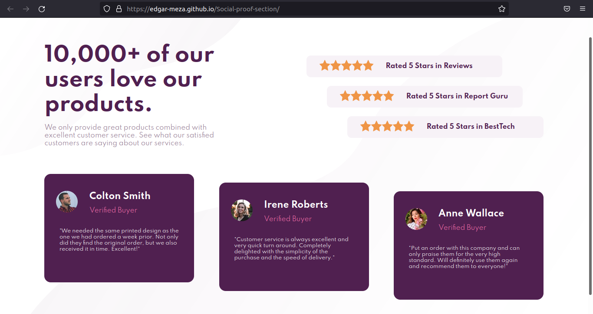

# Frontend Mentor - Social proof section solution

This is a solution to the [Social proof section challenge on Frontend Mentor](https://www.frontendmentor.io/challenges/social-proof-section-6e0qTv_bA). Frontend Mentor challenges help you improve your coding skills by building realistic projects. 

## Table of contents

- [Overview](#overview)
  - [The challenge](#the-challenge)
  - [Screenshot](#screenshot)
  - [Links](#links)
- [My process](#my-process)
  - [Built with](#built-with)
  - [What I learned](#what-i-learned)
  - [Continued development](#continued-development)
- [Author](#author)

## Overview

### The challenge

Users should be able to:

- View the optimal layout for the section depending on their device's screen size

### Screenshot

### Links

- Solution URL: [Solution](https://edgar-meza.github.io/Social-proof-section/)

## My process

### Built with

- Semantic HTML5 markup
- CSS custom properties
- Flexbox
- CSS Grid

### What I learned

I strengthened my knowledge of both HTML and CSS with SASS, learning a little more about applying some attributes and how they work on the website being developed.

### Continued development

I would like to work with the CSS framework tailwind with which I have not worked much but I find it interesting, for this challenge I planned to make use of some framework such as Reactjs, Bootstrap or tailwind but I preferred to test my skills without support from some framework or library.

## Author

- Author - Edgar-Meza
- Frontend Mentor - [@Edgar-Meza](https://www.frontendmentor.io/profile/Edgar-Meza)